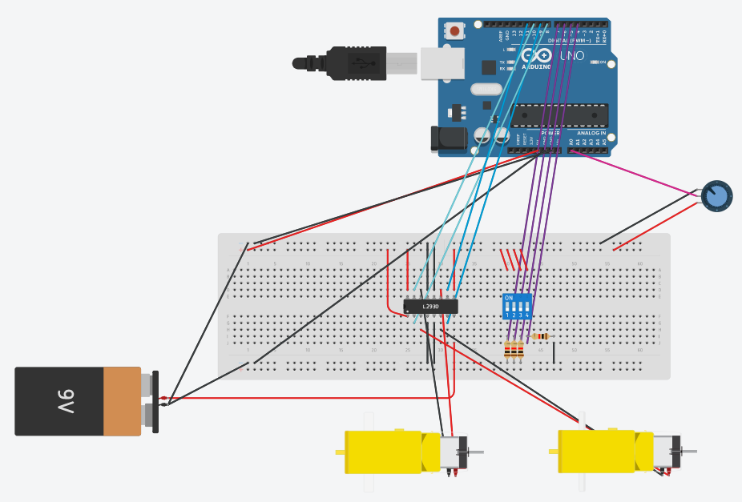

# Project Overview: # 

I wired and programmed 2 motors to an Arduino using the L293D motor controller and using a potentiometer to control the motors speed with PWM. I also used a dip switch to switch between control modes (directions).

 
 

## Project Hardware And Wiring: ##

 

 
 

## Link To Tinkercad Project And Github Repository: ##

>[Tinkercad R3 Software 1 Project Link](https://www.tinkercad.com/things/gE5d5WRU3W2-r3-practise-1 "Altaaf Jahankeer r3 software project 1 Link")

 
 

 ## Contact Information: ##
 

>Name: Altaaf Ahmed Jahankeer  
>Email: ajahankeer@ryerson.ca  
>LinkedIn: https://www.linkedin.com/in/altaaf-jahankeer-8b57091b5/
